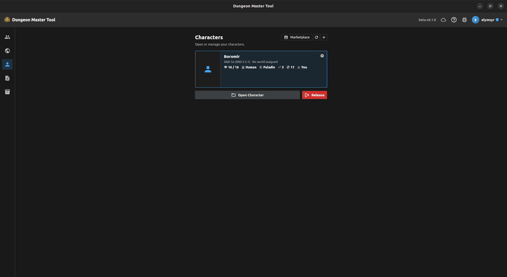
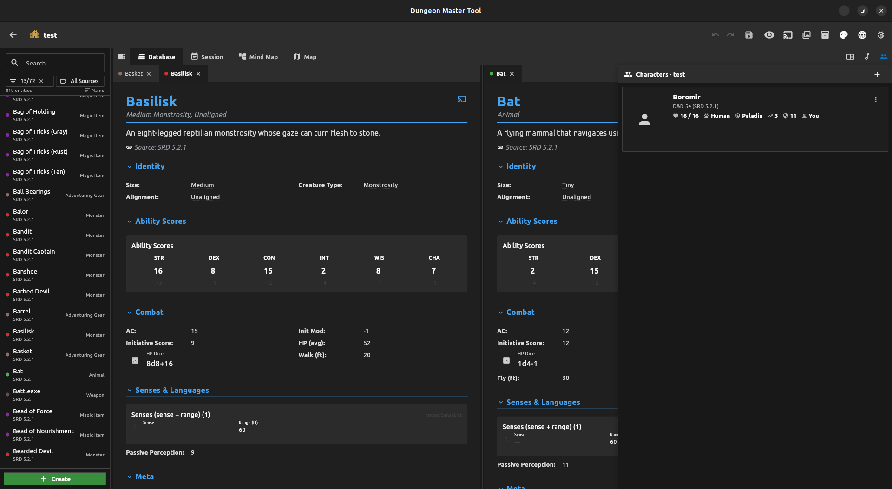
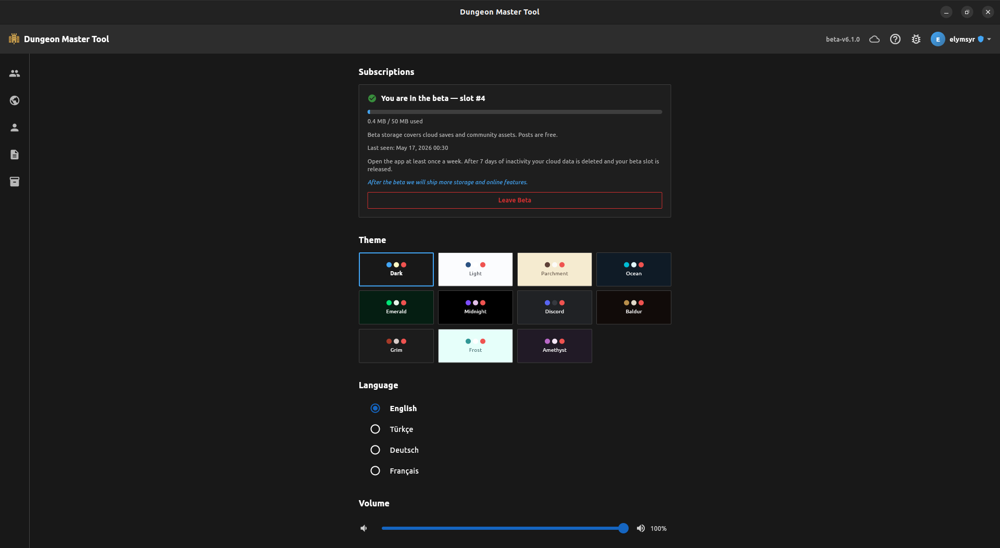
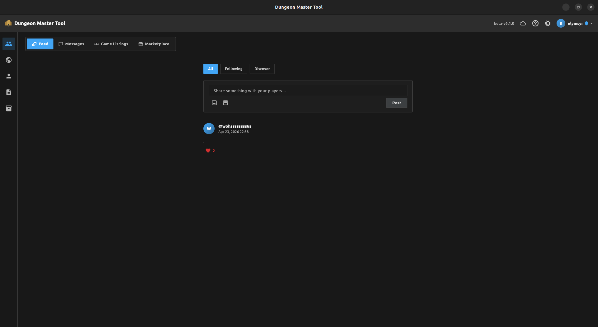
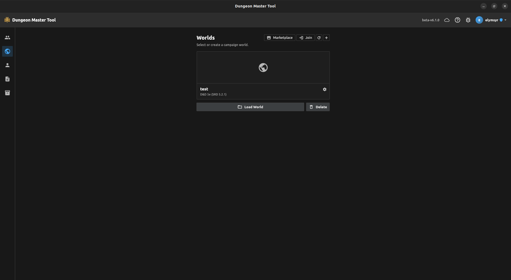
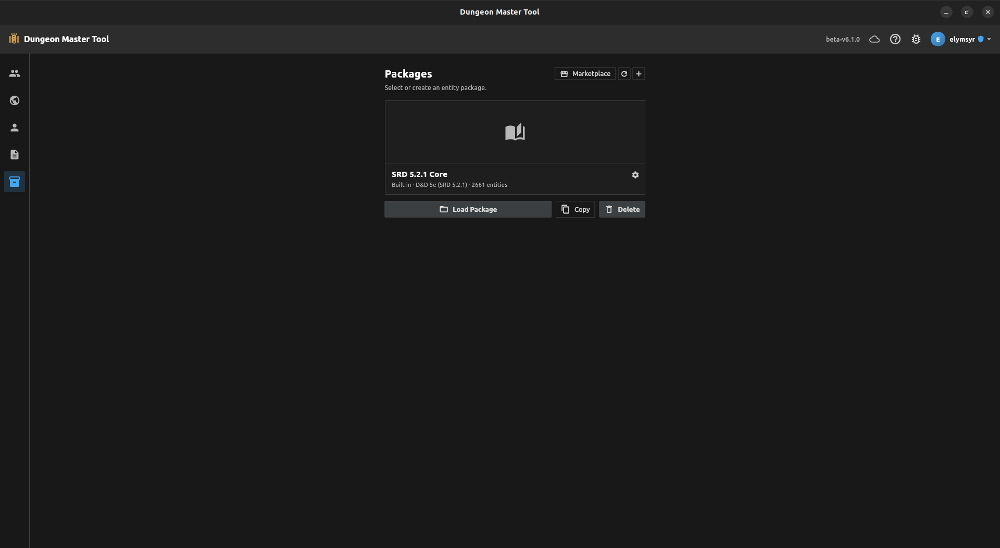

# Dungeon Master Tool

<p align="center">
  <b>A portable, offline-first DM tool.</b><br>
  <i>Build worlds, run sessions, play together — all in one app.</i>
</p>

<p align="center">
  <a href="https://elymsyr.github.io/"><b>Website</b></a> ·
  <a href="https://github.com/elymsyr/dungeon-master-tool/releases/latest"><b>Releases</b></a> ·
  <a href="https://github.com/elymsyr/dungeon-master-tool/issues"><b>Report a Bug</b></a>
</p>

<p align="center">
  
  
  
  
  
</p>

<p align="center">
  <b>Platforms:</b> Android · iOS · Windows · Linux · macOS &nbsp;|&nbsp;
  <b>Languages:</b> EN · TR · DE · FR
</p>

<h3 align="center">Download</h3>

<p align="center">
  <a href="https://github.com/elymsyr/dungeon-master-tool/releases/latest"></a>
  <a href="https://github.com/elymsyr/dungeon-master-tool/releases/latest"></a>
  <a href="https://github.com/elymsyr/dungeon-master-tool/releases/latest"></a>
  <a href="https://github.com/elymsyr/dungeon-master-tool/releases/latest"></a>
  <a href="https://github.com/elymsyr/dungeon-master-tool/releases/latest"></a>
</p>

<p align="center">
  <sub>Support development:</sub><br><br>
  <a href="https://www.patreon.com/elymsyr"></a>
  <a href="https://thanks.dev/u/gh/elymsyr"></a>
  <p align="center">
    <a href="https://groupfinder.eu/library/dungeon-master-tool">
      
    </a>
  </p>
</p>

---

## Roadmap

Planned for upcoming releases — order not final, scope may shift between patch and minor versions.

- **Better battle map system** — Smoother large-grid performance, snap-to-grid tokens with stat-block previews, line-of-sight + dynamic vision, measurement modes (cone/line/sphere), and animated AoE overlays.
- **Built-in D&D 5e package visuals** — Cover art, monster/species/class portraits, equipment icons, and spell glyphs bundled with the SRD core pack so default content stops looking like raw text.
- **More online storage for users** — Larger per-account quota for counted cloud media and selectable retention tiers; current beta cap is intentionally conservative (portraits, covers and live session media already sync free of quota).
- **Deeper D&D 5e implementation** — Close remaining SRD gaps (Drow 120ft superior darkvision, Berserker condition immunities, Lore Bard L3 extra skills, missing `auto_granted_by` metadata), automate more class/subclass effects, and finish bidirectional sync of mechanical resolutions across devices.
- **Full custom-content editors** — WYSIWYG editors for schemas, templates, and packages so creators stop hand-editing JSON.

---

## For Worldbuilders 🗺️

Build a setting, then bring it to the table.

- **Mind Map** — Infinite canvas, Bezier connections, workspaces, undo/redo.
- **World Map** — Pin system with location data, fog of war, timeline metadata per pin.
- **Era Timeline** — Track historical eras and waypoints; pin events to specific points in time.
- **Entity System** — Schema-driven cards with 16 field widget types (text, markdown, image, stat block, dice roller, and more).
- **Templates & Packages** — Built-in D&D 5e schema, user-defined templates, full import/export.

Works fully offline. Join the beta to sync your worlds across devices and share them with collaborators.

---

## For Dungeon Masters ⚔️

Run a session without breaking flow.

- **Combat Tracker** — Initiative, HP, conditions, turn management, automatic event log.
- **Battle Map** — 6-layer canvas (grid, token, annotation, fog, terrain, decal). Draw tool, persistent rulers and circles, fog of war.
- **Session & Campaign Management** — Rich notes, timeline tracking, encounter setup, save state across sessions.
- **Soundpad** — Layered audio, gapless loops, volume fade, custom themes.
- **PDF Viewer** — Page navigation and zoom for your reference docs.
- **Dice Roller** — d4 through d100.

**Second screen, three ways:**
- **Same device** — Pop out a second window for your TV or projector.
- **Different device** — Cast battle maps, entity cards, and images to a tablet or laptop on the side.
- **Online players** — Project directly into every connected player's app. Per-world manifest replays the active view so late joiners catch up instantly.

---

## For Players 🎲

Roll up a character, then take it anywhere.

- **Character Creation Wizard** — SRD-driven: species, class, background, ability scores (point-buy, standard array, roll, manual), skills, equipment, traits.
- **Level-Up Planner** — Auto-applies HP, proficiency bonus, hit dice. Queues ASI/feat, fighting styles, subclass, spell choices as **Pending Choices** you resolve inline.
- **Multiclass** — Full SRD prereq checks (AND/OR ability gates) with human-readable rejection reasons. Multiclass caster slot math built in.
- **Weapon Mastery** — Auto-grants mastery slots per class/subclass; takes the max across overlapping feats.
- **Online Worlds** — Join any world the DM publishes, claim a character, see live updates from every device at the table.
- **Battle Map Marks** — Place your own markers on the projected map during play.

---

## Online & Offline

Everything core works fully offline. Online features (sync, sharing, marketplace, social) require a free account.

- **Closed-Beta Online Play** — When a DM is in the beta, the whole table plays together online. Only the DM needs a beta slot; players just join.
- **Share a World** — Publish a world so players can join and see live updates. One active invite code per world; generate, copy, revoke at will.
- **Realtime Sync** — Character, member, and entity changes stream to every connected client via CDC. Offline edits reconcile on reconnect.
- **Roles** — Player and DM roles with row-level security.
- **Character Ownership** — Claim a world character, release it back, or delete it (DM only, if ownerless).
- **Personal Cloud Sync** — Back up characters, worlds, templates, and packages to your account; pick them up on another device.
- **Cloud Media Tiers** — Portraits and covers sync free of quota. Entity images and battle maps count against your quota with per-kind size limits. **Live session media uses a shared transient pool** that does not bill your save space.
- **Graceful Offline** — Network screens show a clean "You're offline" placeholder and auto-recover. Outbox writes flush on reconnect.

### Marketplace

- **Publish & Share** — Worlds, templates, packages, characters as immutable snapshots with title, description, tags, changelog, cover image.
- **Versioning** — Every publish is a new version. Lineage tracking links every release of the same item.
- **Browse & Download** — Filter by type, language, tags. Atomic download counters; built-in vs. community sections.
- **Integrity** — Database-enforced immutability on core metadata prevents silent edits post-publish.

---

## Social & Community

- **Public Profiles** — Username, display name, bio, avatar, follower counts. Discovery opt-out supported.
- **Follow System** — Optimistic follow/unfollow; browse followers and following per profile.
- **Activity Feed** — Text and image posts, likes, switch between *all* and *following only*. Server-side rate-limited.
- **Direct Messaging** — Realtime 1-to-1 and group chats. Unread counters, group rename, member leave, admin-managed deletion.
- **User Discovery** — Suggested profiles and username search with prefix matching.
- **Game Listings** — Post open games with system, seats, schedule, language, tags. Filter by language/system/tags.
- **Applications** — Players apply with a message; listing owners accept, reject, or applicants withdraw.

---

## Images

<p align="center">
  <table align="center">
    <tr>
      <td align="center"></td>
      <td align="center"></td>
    </tr>
    <tr>
      <td align="center"></td>
      <td align="center"></td>
    </tr>
    <tr>
      <td align="center"></td>
      <td align="center"></td>
    </tr>
    <tr>
      <td align="center"></td>
      <td align="center"></td>
    </tr>
  </table>
</p>

---

## Installation

### Android
1. Download `DungeonMasterTool-Android.apk` from the [latest release](https://github.com/elymsyr/dungeon-master-tool/releases/latest).
2. Enable "Install from unknown sources" if prompted.
3. Open the APK to install.

### Windows
1. Download `DungeonMasterTool-Windows.zip` from the [latest release](https://github.com/elymsyr/dungeon-master-tool/releases/latest).
2. Extract and run `dungeon_master_tool.exe`.

### Linux
1. Download `DungeonMasterTool-Linux.zip` from the [latest release](https://github.com/elymsyr/dungeon-master-tool/releases/latest).
2. Extract and run:
   ```bash
   unzip DungeonMasterTool-Linux.zip
   cd bundle
   ./dungeon_master_tool
   ```

<div id="macos-installation"></div>

### macOS
1. Download `DungeonMasterTool-MacOS.zip` from the [latest release](https://github.com/elymsyr/dungeon-master-tool/releases/latest).
2. Extract and drag `dungeon_master_tool.app` into **Applications**.
3. Remove the quarantine flag:
   ```bash
   sudo xattr -rd com.apple.quarantine /Applications/dungeon_master_tool.app
   ```
4. Launch from Applications or Launchpad.

### iOS
> **Note:** iOS builds are currently unsigned. Sideload via Xcode or a signing service.

1. Download `DungeonMasterTool-iOS.ipa` from the [latest release](https://github.com/elymsyr/dungeon-master-tool/releases/latest).
2. Sideload using Xcode, AltStore, or similar.

---

## Development

```bash
cd flutter_app
flutter pub get
dart run build_runner build --delete-conflicting-outputs
flutter run
```

See [flutter_app/README.md](flutter_app/README.md) for full developer documentation and [CONTRIBUTING.md](CONTRIBUTING.md) for contribution guidelines.

---

## License

Licensed under [CC BY-NC 4.0](LICENSE). See the LICENSE file for details.

---

## Contact

| Platform | Link |
| :--- | :--- |
| **GitHub Issues** | [Report a Bug](https://github.com/elymsyr/dungeon-master-tool/issues) |
| **Instagram** | [@erenorhun](https://www.instagram.com/erenorhun) |
| **LinkedIn** | [Orhun Eren Yalcinkaya](https://www.linkedin.com/in/orhuneren) |
| **Email** | orhun868@gmail.com |
